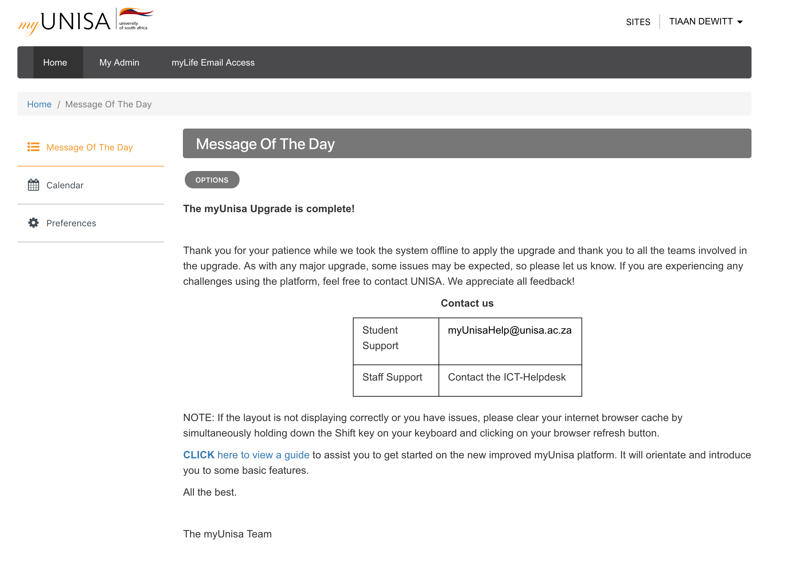

# myUNISA userstyles

> Clean [myUnisa](https://my.unisa.ac.za) userstyles for [Stylish](https://userstyles.org/)

## Install

1. Install the [Stylish extension](https://userstyles.org/) for browser.
2. Open up extension options and paste the CSS.
3. Specify the domain name to be `my.unisa.ac.za`
4. Add a title and save.

Or install via [userstyles.org](https://userstyles.org/styles/166486/myunisa).

## Example

    

## LICENSE

CREATIVE COMMONS ATTRIBUTION 4.0 INTERNATIONAL LICENSE